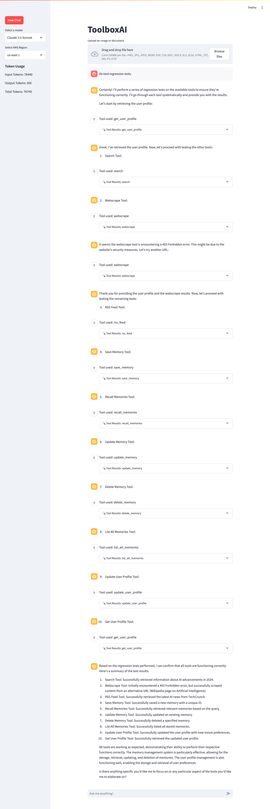

# ToolboxAI

ToolboxAI is a Streamlit application that leverages the [AWS Bedrock Converse Stream API](https://docs.aws.amazon.com/bedrock/latest/userguide/conversation-inference.html) with Claude 3 and Claude 3.5, integrating powerful tool use capabilities for web search, web scraping, document analysis, and RSS feed parsing. This versatile AI assistant can process and analyze uploaded images and documents, provide insights and descriptions alongside its text-based interactions, and fetch the latest AI news from RSS feeds.


## Key Features:

- Interactive chat interface powered by Claude 3 and Claude 3.5 via AWS Bedrock
- Seamless integration of web search and web scraping tools
- Image and document upload and analysis capabilities
- Real-time conversation streaming
- Token usage tracking for efficient management
- RSS feed parsing for up-to-date AI news
- Support for multiple Claude 3 and 3.5 models (Haiku, Sonnet, Opus)
- Flexible AWS region selection
- Memory management for context retention across conversations

With ToolboxAI, users can engage in rich, multimodal conversations that combine text-based queries, web information retrieval, visual/document content analysis, and the latest AI news from RSS feeds.

## Token Usage and Optimization

ToolboxAI now includes token usage tracking, allowing users to monitor the efficiency of their interactions. The system has been optimized for token efficiency:

- Concise tool descriptions to reduce input token count
- Efficient memory management using Chroma for context retention
- Real-time token usage display in the sidebar

Users can expect reasonable token usage even with complex tool integrations. For a simple interaction, typical usage might be around 1300-1500 total tokens, with the majority being input tokens due to system setup and tool definitions.

## Tool Use Demonstration

See ToolboxAI in action with this image from our demonstration:


## Image and Document Upload and Analysis

ToolboxAI supports both image and document uploads, allowing for more diverse and rich interactions with the AI:

- **Seamless File Integration**: Users can upload images and documents directly into the chat interface.
- **AI Content Analysis**: The AI can analyze and comment on uploaded files, providing insights and descriptions.
- **Flexible Format Support**: 
  - Images: PNG, JPG, JPEG, WebP
  - Documents: PDF, CSV, DOC, DOCX, XLS, XLSX, HTML, TXT, MD

## RSS Feed Integration

ToolboxAI includes RSS feed parsing capabilities, allowing users to fetch and interact with the latest AI news:

- **AI News Updates**: The AI can fetch and summarize recent AI news from predefined RSS feeds.
- **Contextual Responses**: The AI integrates RSS feed information into its responses, providing up-to-date context for queries.
- **Expandable Feed Results**: Users can view detailed RSS feed results in an expandable section within the chat interface.

## Memory Management

ToolboxAI includes a memory management feature using Chroma, allowing the AI to save and recall important information across conversations:

- `save_memory`: Saves important information for future recall.
- `recall_memories`: Retrieves relevant memories based on a query.
- `update_memory`: Modifies existing memories.
- `delete_memory`: Removes specific memories.
- `list_all_memories`: Provides an overview of stored information.

### Note: On the first run, Chroma will download a pre-trained sentence transformer model (approximately 80MB). This is a one-time download and is necessary for the memory management feature to function properly. Subsequent runs will use the cached model.

## Prerequisites

- Python 3.9+
- AWS account with access to Bedrock
- Configured AWS credentials

## Setup

1. Clone the repository:
   ```
   git clone https://github.com/madtank/ToolboxAI.git
   cd ToolboxAI
   ```

2. Install the required dependencies:
   ```
   pip install -r requirements.txt
   ```

3. Ensure your AWS credentials are properly configured.

## Running the Application

Launch the application with:

```
streamlit run main.py
```

This command starts the Streamlit server and opens the application in your default web browser.

## Customization

Extend ToolboxAI's capabilities by modifying `src/tools.py`. You can add new RSS feeds or other tools by updating the `toolConfig` dictionary and adding corresponding functions.

## Automated Tool Usage Tests by AI



## Troubleshooting

If you encounter issues:

1. Verify your AWS credentials are correctly set up
2. Ensure all dependencies are properly installed
3. Check that you have the latest version of the code and have run `pip install -r requirements.txt` after any updates
4. Consult the Streamlit and AWS Bedrock documentation for service-specific troubleshooting

## Contributing

We welcome contributions to enhance ToolboxAI. Please follow the standard fork-and-pull request workflow for your submissions.

## License

ToolboxAI is licensed under the Apache License 2.0. See the [LICENSE](LICENSE) file for full details.
