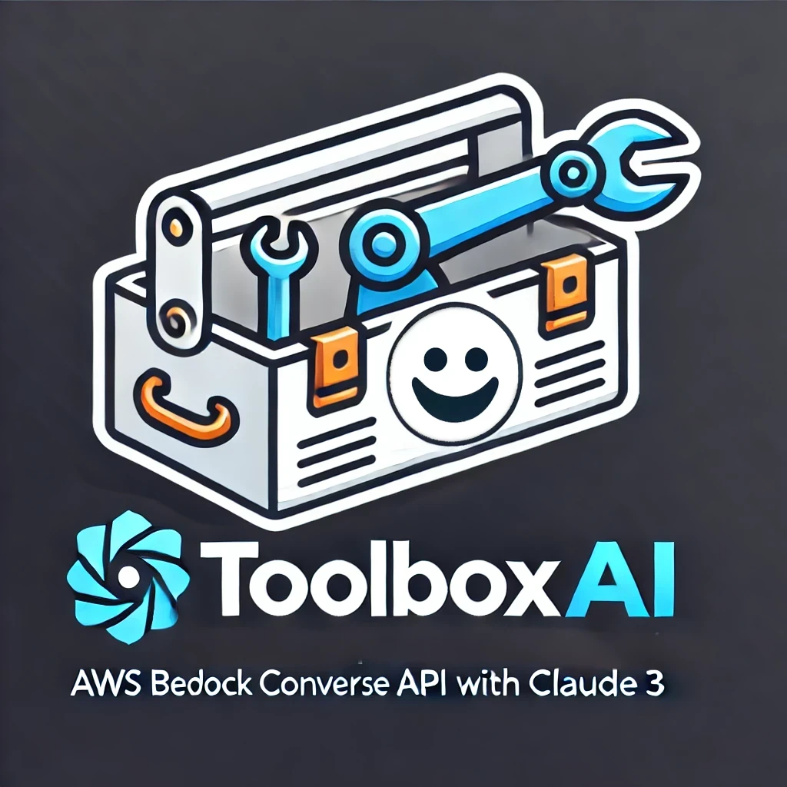

# ToolboxAI



ToolboxAI is a Streamlit application that leverages the [AWS Bedrock Converse Stream API](https://docs.aws.amazon.com/bedrock/latest/userguide/conversation-inference.html) with Claude 3, integrating powerful tool use capabilities for web search and web scraping.

## Tool Use Demonstration

See ToolboxAI in action with this image from our demonstration:


## Prerequisites

- Python 3.9+
- AWS account with access to Bedrock
- Configured AWS credentials

## Setup

1. Clone the repository:
   ```
   git clone https://github.com/madtank/ToolboxAI.git
   cd ToolboxAI
   ```

2. Install the required dependencies:
   ```
   pip install -r requirements.txt
   ```

3. Ensure your AWS credentials are properly configured.

## Running the Application

Launch the application with:

```
streamlit run main.py
```

This command starts the Streamlit server and opens the application in your default web browser.

## Key Features

- Interactive chat interface powered by Claude 3 via AWS Bedrock
- Seamless integration of web search and web scraping tools
- Real-time conversation streaming
- Token usage tracking for efficient management

## Application Structure

ToolboxAI consists of five main components:

1. `main.py`: Streamlit UI and main application loop
2. `src/bedrock_client.py`: AWS Bedrock service interactions
3. `src/conversation_handler.py`: AI response processing and conversation flow management
4. `src/utils.py`: Utility functions for various application needs
5. `src/tools.py`: Tool-related functions and configurations for web search and scraping

## Customization

Extend ToolboxAI's capabilities by modifying `src/tools.py`. Remember to update the `toolConfig` dictionary when adding new tools.

## Troubleshooting

If you encounter issues:

1. Verify your AWS credentials are correctly set up
2. Ensure all dependencies are properly installed
3. Consult the Streamlit and AWS Bedrock documentation for service-specific troubleshooting

## Contributing

We welcome contributions to enhance ToolboxAI. Please follow the standard fork-and-pull request workflow for your submissions.

## License

ToolboxAI is licensed under the Apache License 2.0. See the [LICENSE](LICENSE) file for full details.