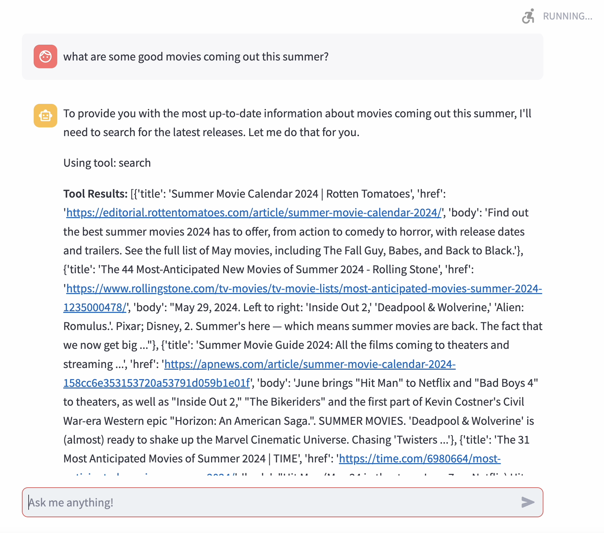
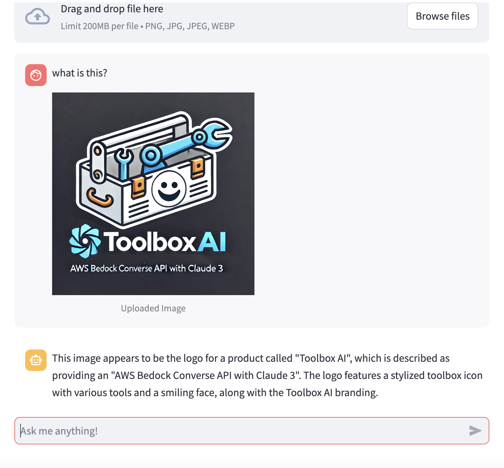
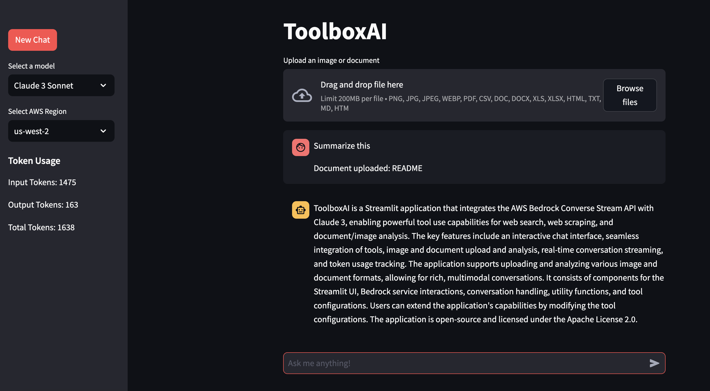

# ToolboxAI

ToolboxAI is a Streamlit application that leverages the [AWS Bedrock Converse Stream API](https://docs.aws.amazon.com/bedrock/latest/userguide/conversation-inference.html) with Claude 3, integrating powerful tool use capabilities for web search, web scraping, and document analysis. This versatile AI assistant can process and analyze uploaded images and documents, providing insights and descriptions alongside its text-based interactions.


## Key Features:

- Interactive chat interface powered by Claude 3 via AWS Bedrock
- Seamless integration of web search and web scraping tools
- Image and document upload and analysis capabilities
- Real-time conversation streaming
- Token usage tracking for efficient management

With ToolboxAI, users can engage in rich, multimodal conversations that combine text-based queries, web information retrieval, and visual/document content analysis.

## Tool Use Demonstration

See ToolboxAI in action with this image from our demonstration:



## New Feature: Image and Document Upload and Analysis

ToolboxAI now supports both image and document uploads, allowing for more diverse and rich interactions with the AI:

- **Seamless File Integration**: Users can now upload images and documents directly into the chat interface.
- **AI Content Analysis**: The AI can analyze and comment on uploaded files, providing insights and descriptions.
- **Flexible Format Support**: 
  - Images: PNG, JPG, JPEG, WebP



  - Documents: PDF, CSV, DOC, DOCX, XLS, XLSX, HTML, TXT, MD



## Prerequisites

- Python 3.9+
- AWS account with access to Bedrock
- Configured AWS credentials

## Setup

1. Clone the repository:
   ```
   git clone https://github.com/madtank/ToolboxAI.git
   cd ToolboxAI
   ```

2. Install the required dependencies:
   ```
   pip install -r requirements.txt
   ```

3. Ensure your AWS credentials are properly configured.

## Running the Application

Launch the application with:

```
streamlit run main.py
```

This command starts the Streamlit server and opens the application in your default web browser.

To use this feature:
1. Click on the "Upload an image" button at the top of the chat interface.
2. Select an image file from your device.
3. The image will be displayed in the chat and can be referenced in your conversations with the AI.

This addition opens up new possibilities for visual-based queries and analyses. Try it out and explore how it enhances your interactions with ToolboxAI!

## Application Structure

ToolboxAI consists of five main components:

1. `main.py`: Streamlit UI and main application loop
2. `src/bedrock_client.py`: AWS Bedrock service interactions
3. `src/conversation_handler.py`: AI response processing and conversation flow management
4. `src/utils.py`: Utility functions for various application needs
5. `src/tools.py`: Tool-related functions and configurations for web search and scraping

## Customization

Extend ToolboxAI's capabilities by modifying `src/tools.py`. Remember to update the `toolConfig` dictionary when adding new tools.

## Troubleshooting

If you encounter issues:

1. Verify your AWS credentials are correctly set up
2. Ensure all dependencies are properly installed
3. Consult the Streamlit and AWS Bedrock documentation for service-specific troubleshooting

## Contributing

We welcome contributions to enhance ToolboxAI. Please follow the standard fork-and-pull request workflow for your submissions.

## License

ToolboxAI is licensed under the Apache License 2.0. See the [LICENSE](LICENSE) file for full details.